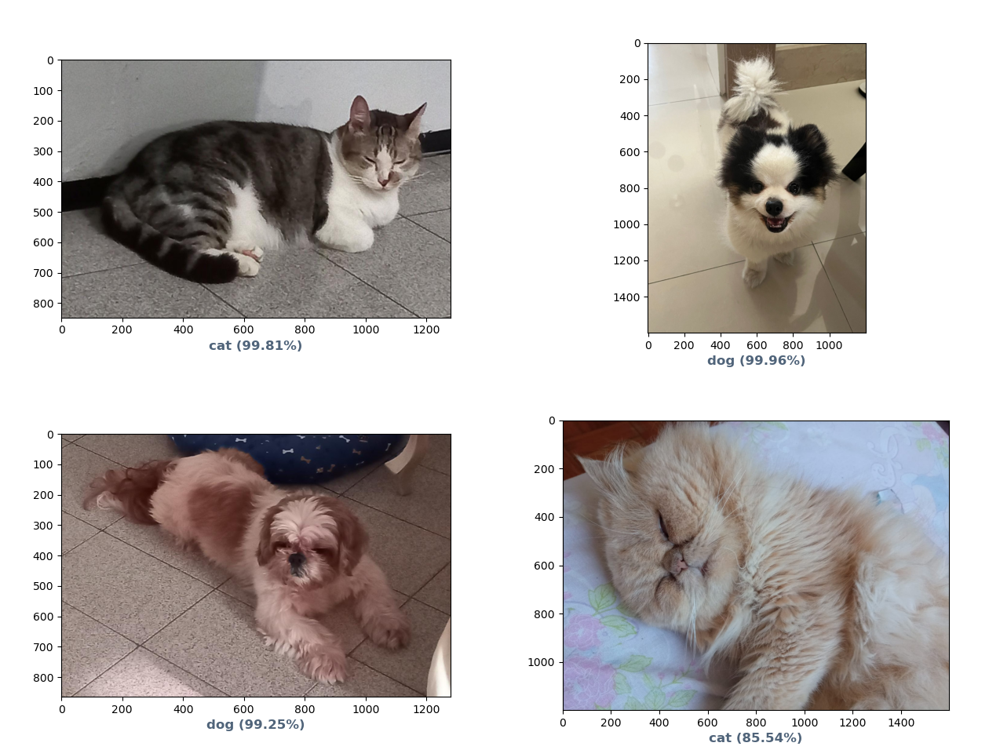

# Dog or Cat classification
---
Convolutional Neural Network for a species classification using PyTorch

| | |
| --- | --- |
| Made in | October 2022 |
| Languages used | Python 3 |
| Libraries used | Pytorch, cv2, numpy, pandas|
| Programs used | VSCode |

## How to use
---
The images can be found on [this link](https://www.kaggle.com/datasets/tongpython/cat-and-dog). Note that the `data.csv` file only works if all the images are on the same directory (`./dataset/set`).

On `./main`, run `python3 train.py [SAVE FILENAME]` to train the model and save it on `./saves`, and run `python3 eval.py [LOAD FILENAME]` to evaluate the accuracy of the loaded model. Saved models will be found on `./saves` 

If you save an image on `./images`, you can run `python3 main.py [IMAGE FILENAME] [LOAD FILENAME]` on `./main`, and it will generate a plot with the predicition from the loaded model.
